# Illustrated setup and operation, step by step

Start here, then follow the installation route you choose. Screenshots show the
actual checked-in application with **clearly labelled example data**. They are
not evidence that a real robot passed calibration, connected, or moved. Terminal
images distinguish actual read-only checks from source-derived references.

## 1. Decide what runs where

| You want | Install where | Follow |
|---|---|---|
| Ubuntu server without Docker | ROS Humble, agent and workspace on Ubuntu 22.04 | [Complete native guide](native.md) |
| Windows server without Docker | WSL2 Ubuntu 22.04; ROS and agent inside Ubuntu | [Windows preparation](native.md#windows-preparation), then native steps 1–6 |
| Container server on Linux or Windows | Docker; on Windows also WSL2 and USB attachment if required | [Complete Docker guide](docker.md) |
| Phone/Windows browser controlling another server | Browser only; server remains on its own PC | Open the server's LAN URL |
| Offline demonstration | Python viewer on your PC | [Viewer guide](../webapp/README.md); this cannot replace the robot server |

The ESP32 runs PlatformIO firmware, the PC runs the ROS server and micro-ROS
agent, and the browser displays/controls that server. Choose Wi-Fi **or** serial
firmware to match the agent transport. USB for flashing alone does not select
serial operation. Keep motor power disconnected during wiring or flashing.

## 2. Install and check dependencies

Follow [native steps 1–3](native.md#1-prepare-ubuntu-and-clone-the-project) for the
exact package, repository, agent-build and workspace-build commands. Commands
marked Bash go in Ubuntu Terminal, including when Ubuntu runs inside WSL.
Commands marked PowerShell go in Windows PowerShell. Do not paste USB console
commands such as `wifi add` into either shell.

After installation, source all three environment files in each new ROS terminal,
then inspect the packages:

```bash
source /opt/ros/humble/setup.bash
source ~/uros_ws/install/local_setup.bash
source ~/GPS_Localize/gps_localize_ws/install/setup.bash
export ROS_DOMAIN_ID=10
ros2 pkg prefix micro_ros_agent
ros2 pkg prefix gps_localize
```

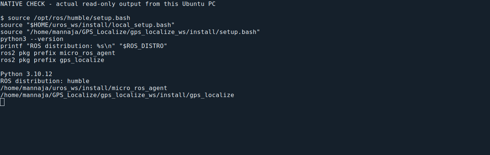

**Where/when:** Ubuntu Terminal, after builds finish. **Why:** installed files
must be discoverable in this shell. **Expected:** package paths, not “package not
found.” Your username and paths will differ from the image. This confirms this
PC's existing installation; it is not a fresh-install recording.

For Docker, use the exact branch/Compose route in the Docker guide instead of
installing native ROS on the host. The [Docker verification record](docker_verification.md)
states what was actually tested. Windows installation dialogs and real USB
acceptance still require the destination Windows PC.

## 3. Connect and configure the board

1. Check [wiring and power](hardware.md), then identify the actual USB adapter.
2. On Windows, complete usbipd install → `list` → administrator `bind` → `attach
   --wsl` before looking for `/dev/ttyUSB*` inside Ubuntu.
3. Install PlatformIO and USB permissions using [native step 4](native.md#4-prepare-usb-and-firmware-tools),
   or the Docker guide's firmware build/upload route.
4. Create the private first-boot seed if absent; do not overwrite an existing one.
5. Build/upload the selected `wifi` or `serial` environment with motor power off.
6. For Wi-Fi, follow [the illustrated Wi-Fi guide](wifi_setup.md) for the OS
   network, board credentials, agent destination and the real browser network page.

**Success:** the upload reports success, then the firmware connects through the
matching agent. Upload success alone does not verify sensors or networking.

## 4. Start the server once

Use [native step 5](native.md#5-start-manually) for manual launch, or the Docker
guide's Compose command. Stop existing managed/manual instances before changing
modes. Do not start two agents owning the same USB port or two web servers on 8080.

To inspect available native launch arguments without starting anything:

```bash
ros2 launch gps_localize bringup.launch.py --show-args
```

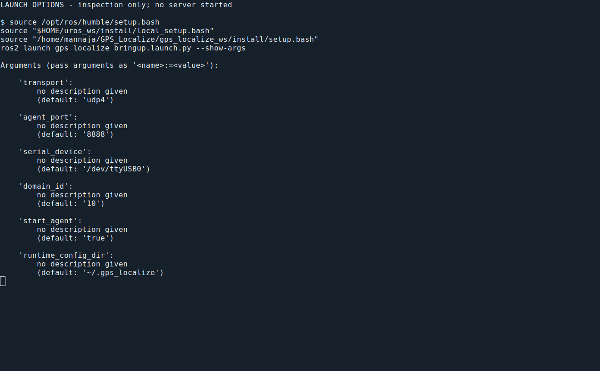

**Where/when:** sourced Ubuntu Terminal, before choosing Wi-Fi/serial launch.
**Why:** `transport`, `serial_device` and `start_agent` determine which process
owns the connection. `start_agent:=false` is for a separately running agent.

Open `http://localhost:8080` on the server. From a phone, use
`http://SERVER_LAN_IP:8080` on a reachable network. The screenshot address
`192.0.2.10` is an example and must be replaced. Verify the firmware node and
fresh telemetry as described in [native step 6](native.md#6-open-the-ui-and-verify-the-connection).

## 5. Read Dashboard before operating

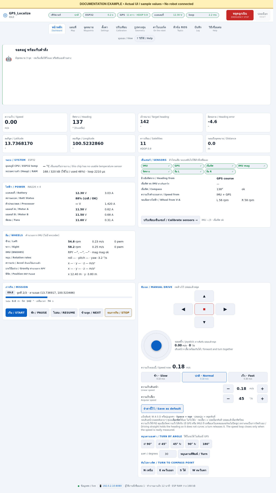

**Where:** first tab, **แดชบอร์ด / Dashboard**. **When:** every startup and before
any operation. **What:** connection/telemetry age, battery, stop reasons, position,
heading, sensor rates and manual/mission controls. **Why:** a loaded page does not
mean the firmware is healthy. Verify increasing uptime, recent data, plausible
battery and the sensors required for your intended operation.

For attended manual operation, use the dashboard's hold/release arrows or
joystick and a suitable low speed. Releasing the control requests a stop. Keep
the operator present with an accessible emergency stop; read [safety](safety.md)
first. START/RESUME and map Go can command motion. No motion control was activated
while capturing these pictures. STOP is available for stopping operation; do not
confuse stopping a mission with shutting down server services.

For the earlier ROS YAML error, [running](running.md) contains the properly quoted
Twist command. Continuous publication continues requesting motion until stopped;
use only during an attended test, with the browser heartbeat and interlocks
working. Do not bypass safety to make a command run forever.

## 6. Map and waypoints

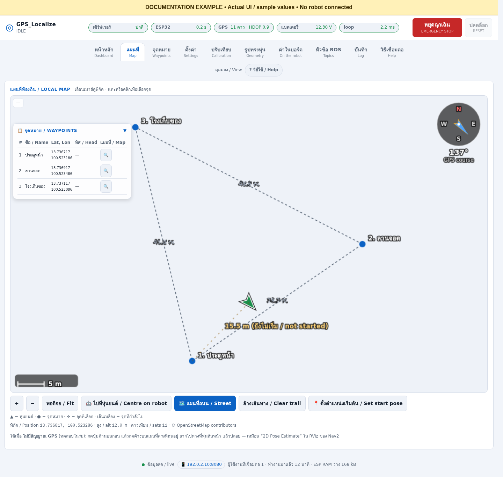

**Where:** **แผนที่ / Map**. Use zoom, fit and centre to inspect the route before
running it. The capture intentionally blocks external tile requests; the grid is
not evidence of a fault on your network. Clicking the map opens location actions;
**Go** requests immediate navigation, while adding a waypoint edits the route.
Check the coordinates and intended action before clicking. Clearing the trail
removes displayed history; setting a start pose changes the coordinate reference.

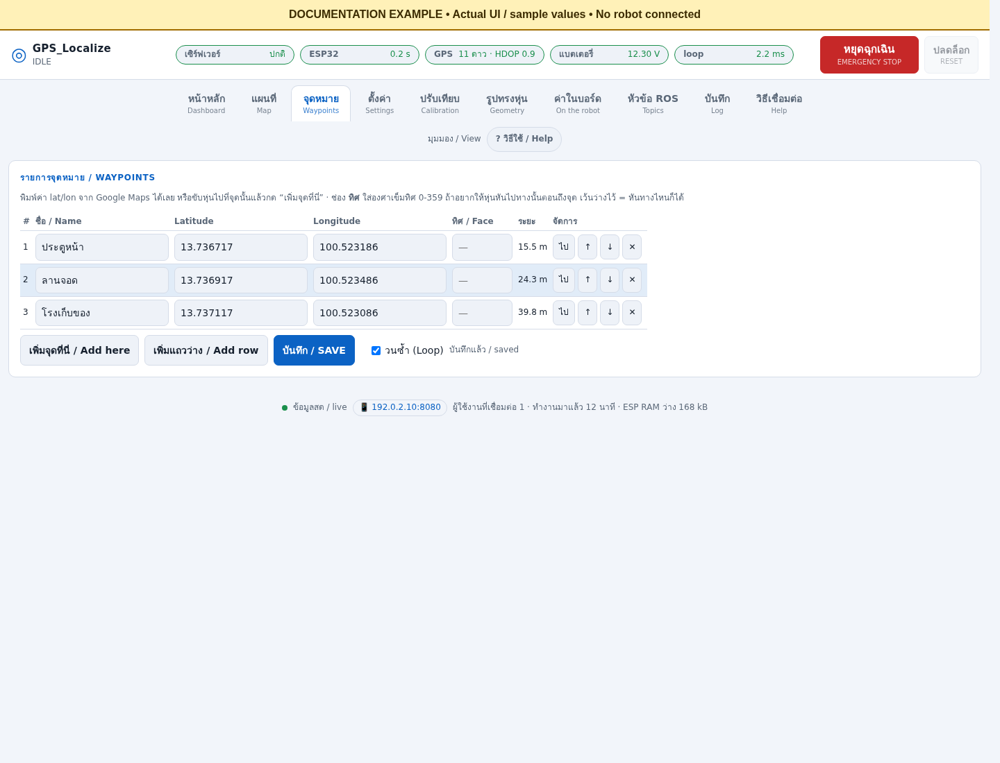

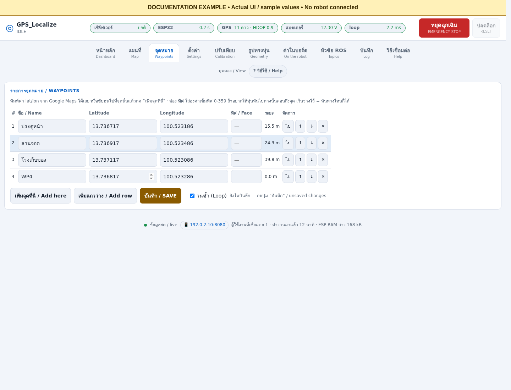

**Where:** **จุดหมาย / Waypoints**. **When:** before starting a route, with the
robot stopped. Click **Add row**, enter a name and latitude/longitude, and set an
optional final facing angle where needed. Check decimal coordinates carefully.
**Add here** uses the current position; do not use it with stale or invalid GPS.
Click **Save** to store edits. Review order and the loop option; loop repeats the
route. Saving is separate from START on Dashboard. Follow [acceptance](acceptance.md)
for the first attended route rather than using screenshot coordinates.

## 7. Server settings: edit, save, verify

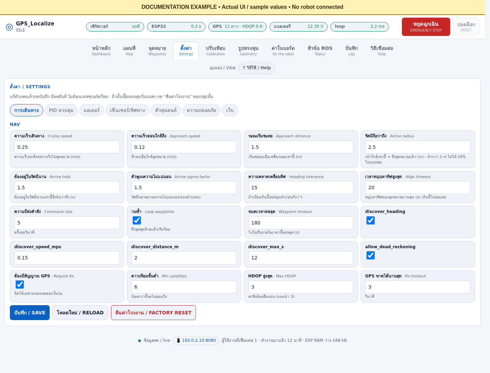

**Where:** **ตั้งค่า / Settings**, then a group. **What:** server configuration
saved under `~/.gps_localize` (the Docker runtime volume in containers).
**How:** stop operations, record the old value, edit the relevant field, press
**Save**, then reload/read the values to verify persistence. **Reload** discards
unsaved edits by reading server settings. **Factory reset** deliberately restores
defaults; it is not a connection-repair button. Read units and descriptions in the
actual form. Do not copy illustrative values as measured calibration.

| Click this group | What/when/why | Actual screenshot |
|---|---|---|
| nav | Navigation speeds and arrival behaviour; tune during attended route testing | [Navigation](screenshots/settings-nav.png) |
| pid | Heading controller gains; change with measured response and a rollback value | [PID](screenshots/settings-pid.png) |
| motor | Host motor configuration; check against measured hardware | [Motor](screenshots/settings-motor.png) |
| estimator | Pose/sensor fusion configuration; diagnose measurements before adjusting | [Estimator](screenshots/settings-estimator.png) |
| robot | Host robot dimensions/settings; keep consistent with actual hardware | [Robot](screenshots/settings-robot.png) |
| safety | Host watchdog/interlocks; understand each protection before changing | [Safety](screenshots/settings-safety.png) |
| web | Browser/server presentation and connection settings | [Web](screenshots/settings-web.png) |

Server Settings and board NVS parameters are different stores. A field with a
similar name does not establish that editing one updates the other.

## 8. Calibration and geometry

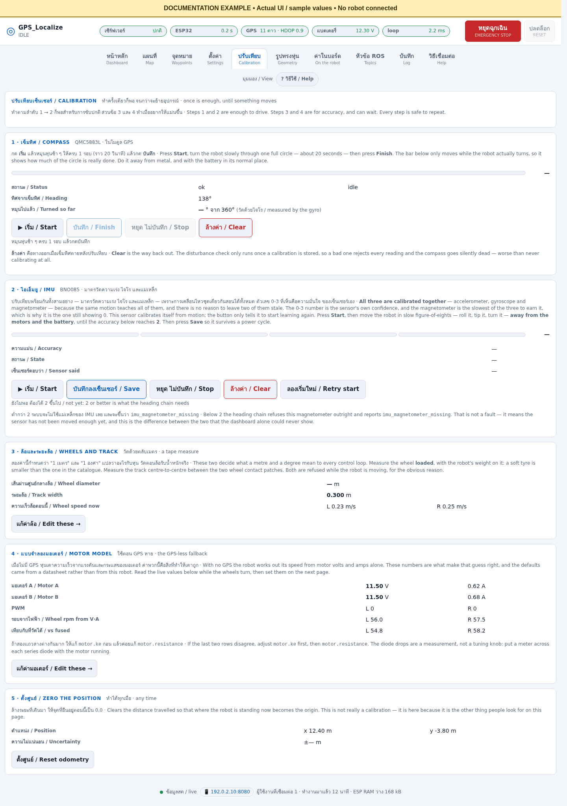

**Where:** **ปรับเทียบ / Calibration**. Work through [calibration](calibration.md)
for the measured procedure and interpretation. Compass Start begins collection;
Finish attempts to save sufficient coverage; Stop ends collection; Clear removes
stored calibration. IMU Start/Save control the sensor's calibration, with accuracy
feedback. Do not interpret absent magnetometer rotation-vector reports as failure
when the configured BNO085 mode uses only the game rotation vector.

The wheel and motor cards link to their parameter fields. Measure dimensions and
electrical constants; screenshot numbers are examples. Reset odometry changes the
position origin and belongs only in a stopped, deliberate setup procedure.
Physical calibration and motor measurements were not performed for these images.

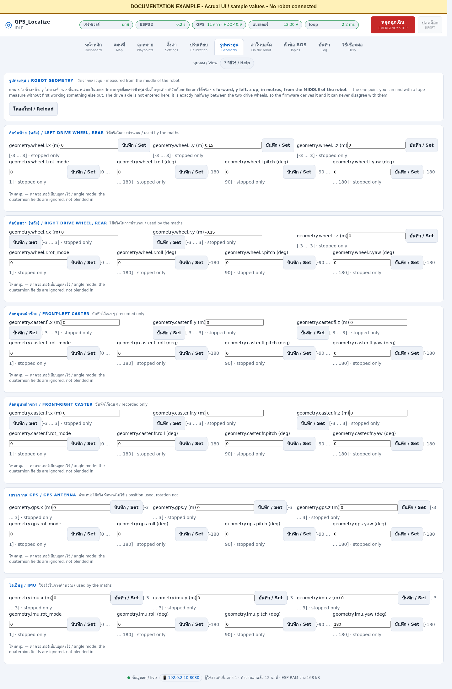

**Where:** **โครงสร้าง / Geometry**. **When:** after measuring the actual robot,
before trusting lever-arm corrections. Select each mount (left/right wheels,
front-left/front-right casters, GPS, IMU), enter measured XYZ in metres, and use
the orientation representation shown by the form. Read the coordinate convention
in [hardware](hardware.md). Write while stopped and pull/read back to verify.
Caster geometry is recorded metadata; not every displayed orientation affects
current estimation. The GPS position offset is used; its orientation is not.

## 9. On the robot: persistent board parameters

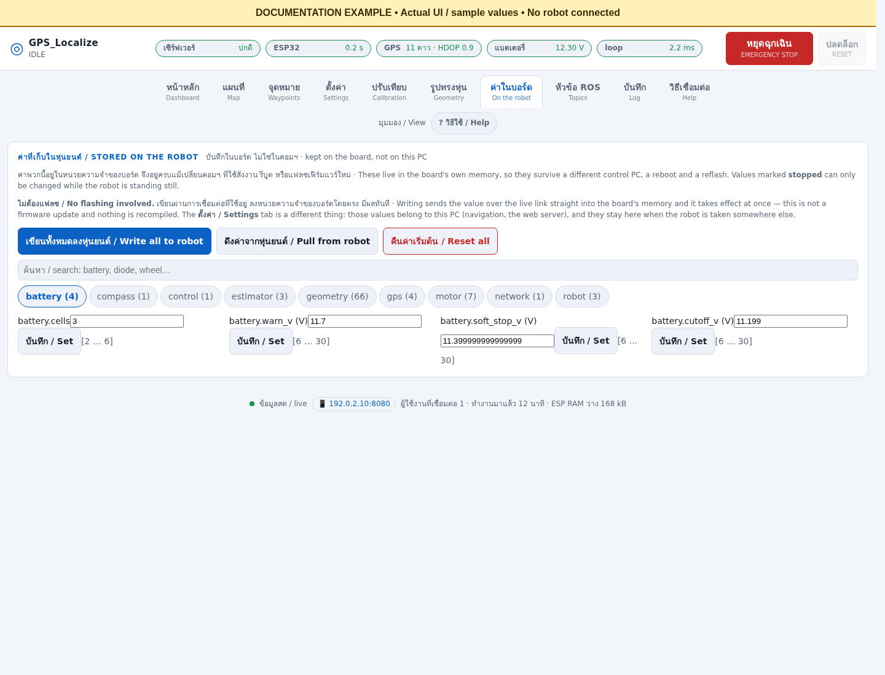

**Where:** **บนหุ่น / On the robot**, then the group. **What:** numeric parameters
on the ESP32, stored in NVS. **How:** pull current values, record the old setting,
change a field while stopped, use its **Set** button, then pull/read back. The
bulk write applies changed values; reset-all replaces stored settings with
defaults. A displayed example or a clicked button is not an acknowledgement from
real hardware. The page may refuse writes while moving or disconnected.

| Group | Purpose and reason to open it | Actual screenshot |
|---|---|---|
| battery | Pack thresholds; check against the actual battery and safety design | [Battery](screenshots/robot-battery.png) |
| compass | Compass-related parameter(s); use the calibration procedure | [Compass](screenshots/robot-compass.png) |
| control | Board control-loop setting(s); engineering tuning | [Control](screenshots/robot-control.png) |
| estimator | Board estimator settings; compare measured sensor behaviour | [Estimator](screenshots/robot-estimator.png) |
| geometry | Mount offsets and orientations; enter measured robot geometry | [Geometry](screenshots/robot-geometry.png) |
| gps | GPS validity/quality-related settings; diagnose actual fixes first | [GPS](screenshots/robot-gps.png) |
| motor | Motor electrical/model parameters; use measured values | [Motor](screenshots/robot-motor.png) |
| network | Transmit power only; **not** SSID/password | [Network](screenshots/robot-network.png) |
| robot | Wheel dimensions/robot parameters; match physical measurements | [Robot](screenshots/robot-robot.png) |

For SSID/password and agent IP, follow [Wi-Fi setup](wifi_setup.md). There is no
browser Wi-Fi credential editor or separate Firmware tab in this UI version.
Firmware update commands are in [running](running.md#flashing-the-board).

## 10. Inspect topics, logs and connection help

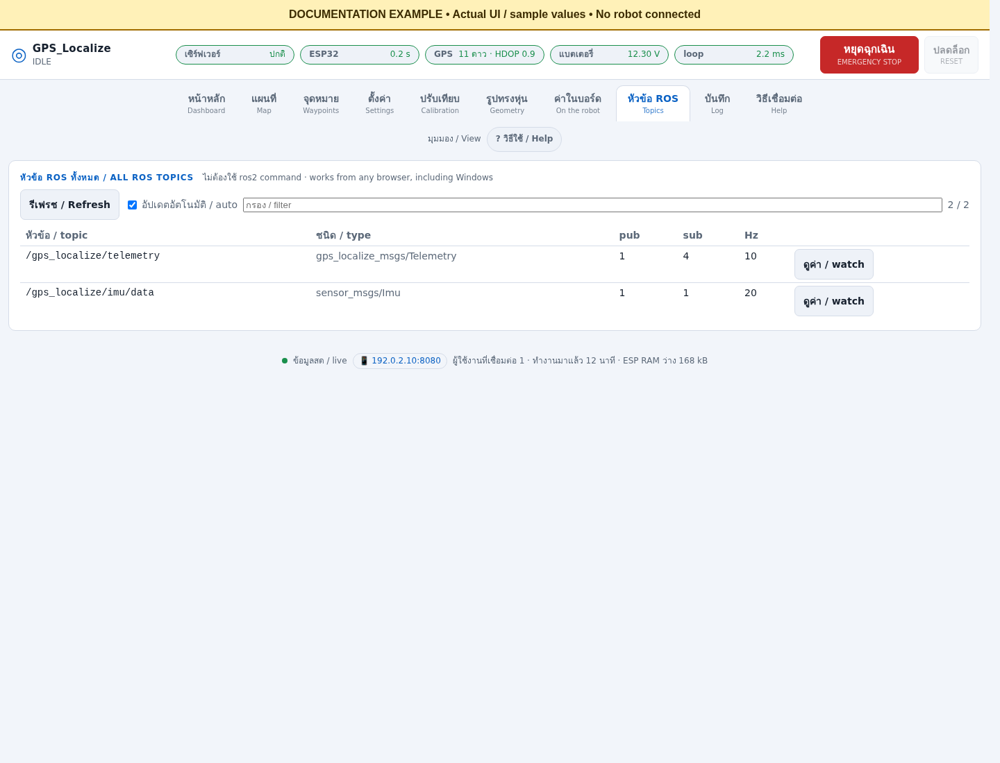

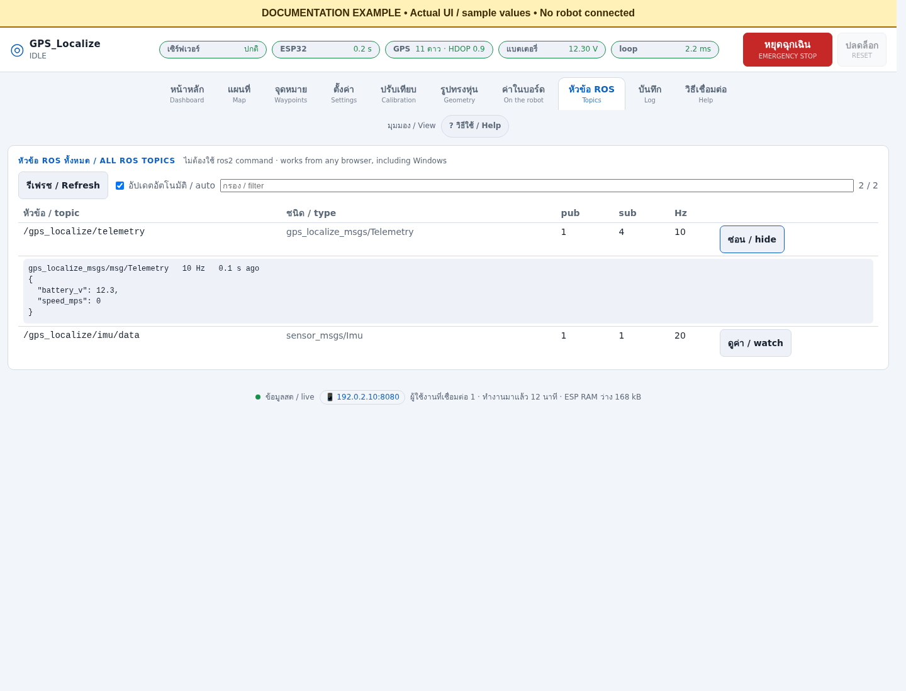

**Where:** **Topics**. Select a topic/watch control to inspect data when diagnosing
missing updates. Topic existence alone is not proof of board connection: a host
subscriber can create a topic. Compare firmware node presence and telemetry age.
The screenshot's messages come from the isolated example backend.

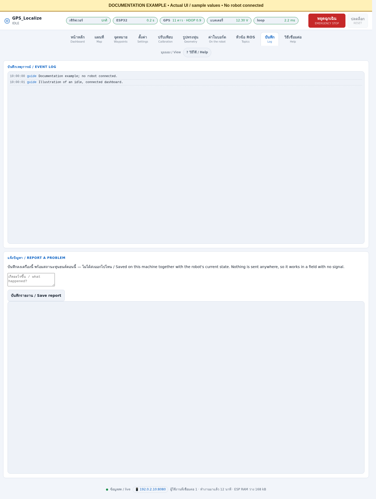

**Where:** **บันทึก / Log**. **When:** after a fault and before rebooting away its
context. Read timestamped events and stop flags. Use the bug-report function when
sharing a reproducible problem, then inspect the generated files for installation
addresses or other private details before sharing them.

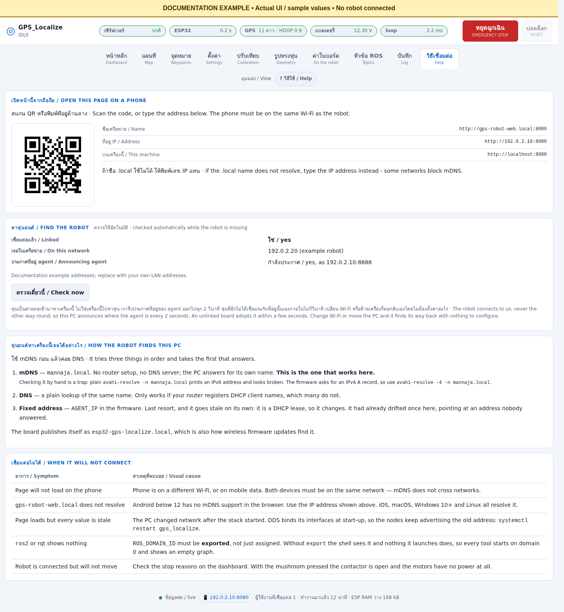

**Where:** **วิธีเชื่อมต่อ / Help**. Use the server URL/QR from your running server
to open it on another device. The screenshot QR targets an example IP and will
not connect to your robot. Read Find the robot when diagnosing discovery. Optional
beacon/network helper behaviour depends on which services you installed; verify
actual service status rather than assuming the developer PC's hostname applies.

## 11. Autostart, daily shutdown and updates

After manual verification, choose services using [native step 7](native.md#7-optional-autostart-on-ubuntu)
or the Docker guide's restart policy. Preview the native installer first:

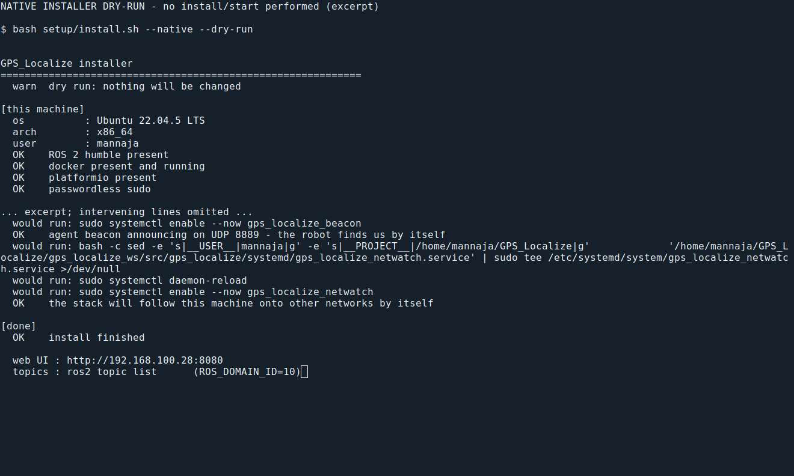

**Where/when:** Ubuntu Terminal, after deciding to use managed services.
**Why:** the real installer enables and starts services. The image is explicitly
a dry-run excerpt, not a completed installation. Stop the manual stack before
running it. WSL autostart does not itself start Windows/reattach USB after reboot.

For daily shutdown, stop robot operation first, then stop the manual launch with
Ctrl+C or the selected services/Compose stack. Back up runtime settings before
updates; source code, saved server settings, board NVS and private firmware
credentials are separate things. Follow the exact [native backup/update steps](native.md#updates-and-backups)
or [Docker guide](docker.md). Keeping a laptop awake does not prevent shutdown
from loss of power; use the server's normal power arrangements.

