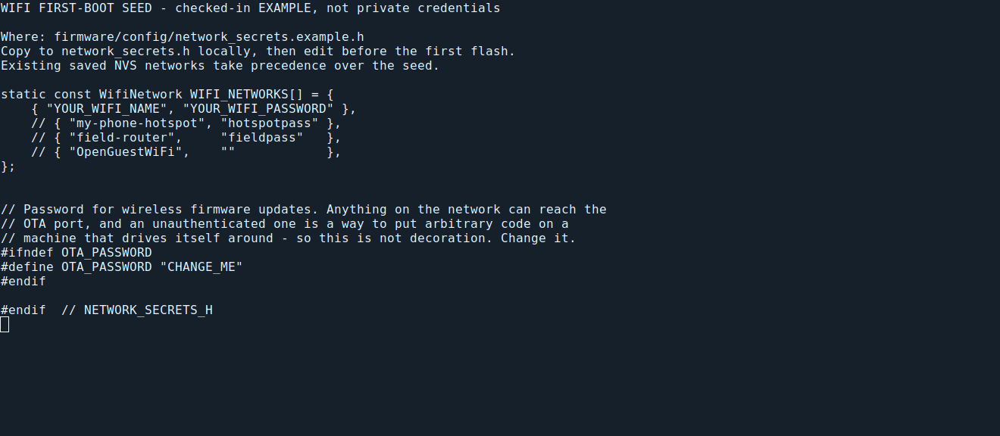
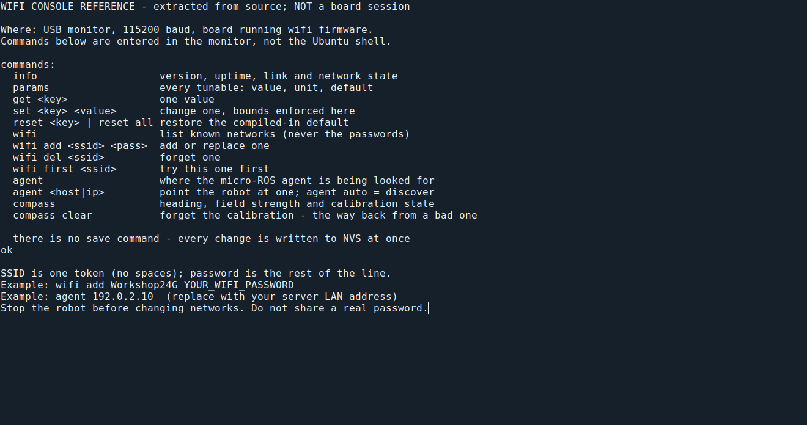
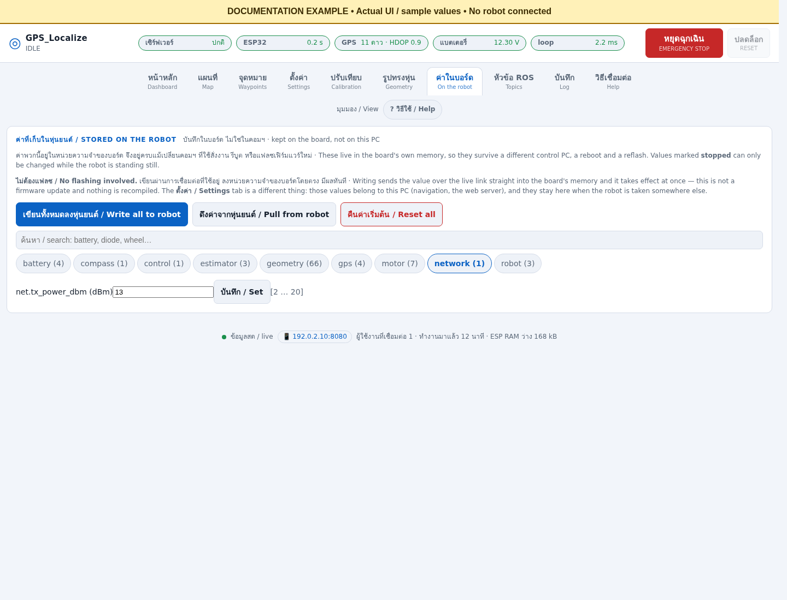

# Wi-Fi setup: where each setting lives

Use this after installing the server and before operating the robot. The ESP32
uses 2.4 GHz Wi-Fi. The server may use Ethernet on the same reachable network.
A USB cable used for flashing does not change `wifi` firmware into serial firmware.

## 1. Choose the network on the computer

| Computer | Where to open | What to do | Why and expected result |
|---|---|---|---|
| Ubuntu desktop with a Wi-Fi adapter | Top-right system menu → Wi-Fi → Select Network, or Settings → Wi-Fi | Select your 2.4 GHz router/hotspot, enter its password, and connect | The PC needs an address reachable from the ESP32. Run `hostname -I` to inspect addresses. |
| Ubuntu with Ethernet | Settings → Network → Wired | Connect Ethernet to the robot's router | Wi-Fi hardware is unnecessary on the server when Ethernet reaches the same LAN. |
| Windows | Settings → Network & internet → Wi-Fi → Show available networks | Select the router/hotspot and connect | Joining Wi-Fi alone does not expose a WSL/Docker UDP server; complete the networking route below. |
| Windows mobile hotspot, if needed | Settings → Network & internet → Mobile hotspot → Properties → Edit | Choose a network name without spaces, a password, and 2.4 GHz where supported; enable sharing | The board cannot join a 5 GHz-only hotspot. Keep the hotspot active while operating. |

OS labels can vary by version and language. This Linux documentation session has
no Windows desktop and no active Wi-Fi adapter; these OS dialogs have **not** been
captured or tested here. See the [capture checklist](screenshots/README.md) for
screens still needed from the destination PC. Do not change a working server's
network during a mission: the board can lose its link and the ROS processes may
need a restart after the address changes.

Use [native Ubuntu/WSL instructions](native.md#browser-and-wi-fi-networking) or
[Docker instructions](docker.md) for the actual server. Native Ubuntu needs the
ESP32 to reach UDP 8888. Windows WSL NAT does not expose that UDP port automatically.
Use the documented mirrored-network/firewall route or use serial transport.
Windows Docker uses the documented published-port Compose override; still verify
incoming traffic from the actual board. `localhost` means the machine using it,
so it is never the server address to enter on the ESP32.

## 2. Set credentials for a new board

On the Ubuntu machine that builds firmware, open the project directory:

```bash
cd ~/GPS_Localize
# Run only if the private file does not already exist:
test -e firmware/config/network_secrets.h || \
  cp firmware/config/network_secrets.example.h firmware/config/network_secrets.h
nano firmware/config/network_secrets.h
```

Edit the `WIFI_NETWORKS` entries with your router name and password, and replace
the example OTA password. Save with Ctrl+O, Enter, then exit with Ctrl+X in nano.
Keep this file private; never add it to Git or include it in screenshots.



**What the image shows:** the actual example header, rendered as a terminal
reference. It is not a capture of private credentials or a successful flash.
The header seeds a board with no stored network list. Rebuilding this file does
not replace networks already saved in NVS. For an existing board use step 3.
Build/upload the `wifi` environment using [native step 4](native.md#4-prepare-usb-and-firmware-tools)
or the Docker guide, with motor power disconnected.

## 3. Change an existing board through its USB console

This is the actual SSID/password editor. The current browser UI has no such editor.
Use a board running **wifi firmware**; serial firmware reserves USB for binary
micro-ROS traffic. Stop the robot and disconnect motor power before opening the
monitor, because opening USB can reset the board. Close other serial programs.
On Windows, attach the device to Ubuntu with usbipd first if using WSL.

```bash
cd ~/GPS_Localize/firmware
pio device monitor --port /dev/ttyUSB0 --baud 115200
```

Replace `/dev/ttyUSB0` with the adapter found in Ubuntu. Enter the following
commands **inside that monitor**, not at the Ubuntu shell prompt:

```text
help
wifi
wifi add Workshop24G YOUR_WIFI_PASSWORD
wifi first Workshop24G
wifi
agent 192.0.2.10
agent
```

Replace `Workshop24G`, the password, and `192.0.2.10` with your values. That IP is
a documentation example, not a real server. This console splits the SSID at
whitespace: **SSID names containing spaces are not supported by this command**;
adding quotes does not fix that parser. Use a network name without spaces for
this route. The password occupies the remainder of the line.



| Command | What and why | How to check |
|---|---|---|
| `wifi` | List saved networks in priority order; passwords are not returned | Your SSID appears in the list |
| `wifi add SSID PASSWORD` | Add or update credentials in the board's NVS | Read the reply and list networks again; saving alone does not prove association |
| `wifi first SSID` | Put a saved network first in the next connection attempt | It becomes the first list entry |
| `wifi del SSID` | Remove an obsolete saved network | Use only when you intend to forget it; verify the remaining list |
| `agent SERVER_IP` | Save the reachable ROS server destination | `agent` reports the choice; it applies on reconnect |
| `agent auto` | Clear the manual override and restore discovery | Use when the server's discovery route is configured and reachable |
| `info` | Read board/sensor status | Inspect actual connection information after reconnect |

A saved list or priority change does not prove the current healthy connection
has switched. After configuration, close the monitor with Ctrl+C and arrange an
attended board restart with motor power disconnected, then verify the resulting
SSID/address and ROS link. Do not erase NVS just to change a password: it also
holds other settings. If no readable console appears, check the firmware
transport, device ownership, data cable and 115200 baud before trying a reset.

## 4. Find the browser's network parameter

1. Open `http://localhost:8080` on the server, or its reachable LAN address.
2. Click **บนหุ่น / On the robot** in the top tab row.
3. Click the **network** group.
4. Inspect `net.tx_power_dbm`. This is transmit power, not a network name.
5. If an attended engineering adjustment is needed, stop the robot, enter the
   intended value, press **Set**, and pull/read it back to verify acknowledgement.



The example displays 13 dBm. Do not raise it simply to configure Wi-Fi: higher
radio current has caused sensor brownouts on this hardware when powered by USB
alone. Changing this field will not set the SSID, password, or server IP.
The image uses example data; it does not report the connected robot's settings.

## 5. Confirm the complete route

1. Start exactly one server/agent stack using the chosen installation guide.
2. Source the ROS environment and set `ROS_DOMAIN_ID=10`.
3. Run `ros2 node list`: look for `/gps_localize_firmware`, not just host nodes.
4. Run `ros2 topic echo /gps_localize/telemetry --once --qos-reliability best_effort`.
5. Open Dashboard and verify fresh telemetry and increasing uptime. Check stop
   reasons and sensors before any attended operation.

A web page opening proves browser-to-server access only. A saved SSID proves
configuration storage only. A firmware node plus fresh telemetry proves the
board-to-agent-to-ROS data route. If the PC changes network, stop operations and
restart the stack as described in [running](running.md); optional network helper
services may handle that restart on installations that enable them.
